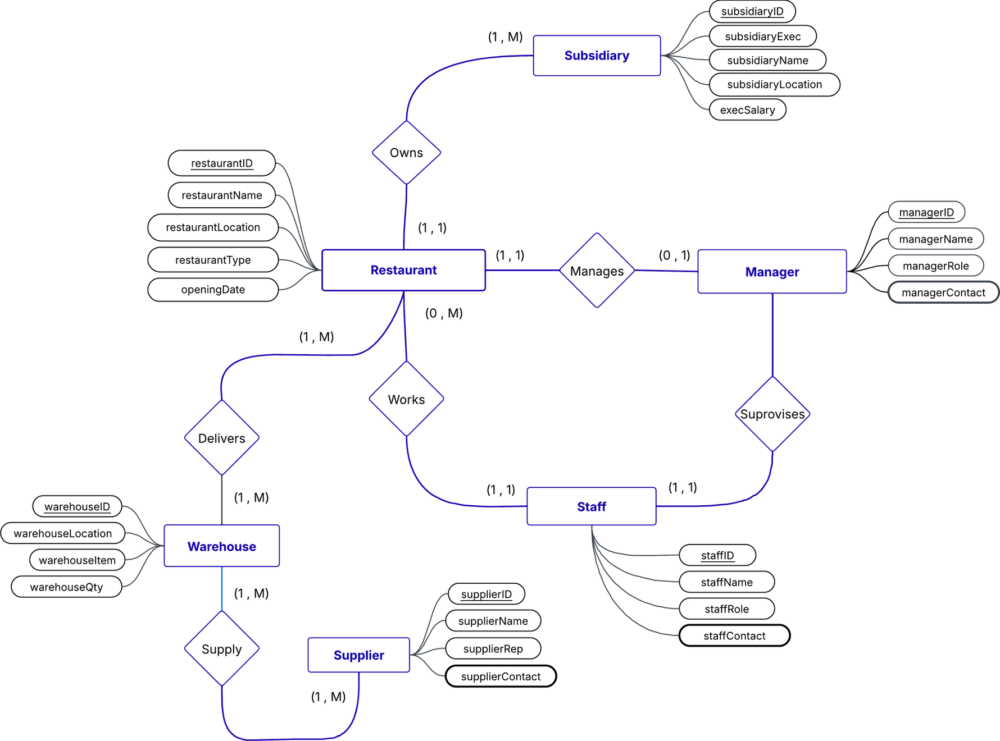

# Resturants Company Database
### Project Overview
The OATA Restaurant Database is a relational database designed to model the operational structure of a multi-subsidiary restaurant company. The schema is derived from an Entity–Relationship (ER) diagram and mapped into normalized relational tables representing subsidiaries, restaurants, warehouses, suppliers, managers, and staff. The database was implemented using PostgreSQL with full table creation, constraints, and sample data insertion. An ORM layer was developed using SQLAlchemy to enable programmatic interaction with the schema. This project demonstrates end-to-end database design from conceptual modeling to application integration.

### 🧩 Entity Relationship Diagram (ERD)

The ER diagram illustrating entities, attributes, and relationships.

### 🛠️ Technologies Used
- PostgreSQL
- SQL (DDL & DML)
- SQLAlchemy (Python ORM)
- Relational Database Design & Normalization